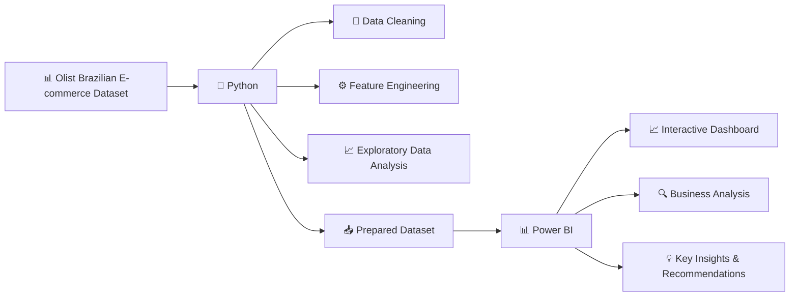

# 🛒 Olist E-commerce Data Analysis

## Objective

This project analyzes **Olist Brazilian e-commerce data** to identify patterns in sales, revenue, product categories, customer geography, delivery performance, payment behaviour, customer satisfaction, and repeat purchasing.

This project was completed as part of a **Data Analysis Hackathon by Gradient Learning**, with the objective of transforming raw e-commerce data into meaningful business insights and actionable recommendations.

The analysis focuses on understanding **where the business is growing, where customer experience is facing friction, and which factors can be improved to support long-term growth**.

## Tech Stack

* **Python** – Data cleaning, feature engineering and exploratory data analysis (EDA)
* **Pandas & NumPy** – Data manipulation and feature engineering
* **Matplotlib & Seaborn** – Exploratory data visualisation
* **Power BI** – Interactive dashboard development and business insights

## Links

- **Dataset:** [Olist Brazilian E-commerce Dataset](https://www.kaggle.com/datasets/olistbr/brazilian-ecommerce)
- **Python Notebook:** [Google Colab](https://colab.research.google.com/drive/12erngs2H0GMYLuhQJNGNNLCSVENvMujY#scrollTo=7645573e)
- **Power BI Dashboard:** [View Dashboard](https://app.powerbi.com/)

## 🔄 Project Workflow

## Key Insights

- Olist generated approximately **99K orders** and **R$16M in item revenue**, showing strong marketplace activity during the analysed period.

- **November 2017 recorded the highest order volume**, with around **7,289 orders**, making it the strongest month in the dataset.

- **Late delivery is strongly associated with lower customer satisfaction**. On-time or early orders had an average review score of around **4.29**, compared with around **2.57 for late orders**.

- As delivery delays become more severe, **review scores decline sharply**, highlighting delivery performance as one of the clearest opportunities to improve customer experience.

- **São Paulo contributes the highest order volume**, followed by other major states such as Rio de Janeiro and Minas Gerais, showing that demand is concentrated in major markets.

- **Bed & bath, health & beauty, sports & leisure, and furniture/decor** are among the strongest product categories by order volume.

- **Credit cards are the dominant payment method**, while higher installment counts are generally associated with higher order values.

- **Repeat customers generate higher revenue per customer** than one-time customers, making customer retention an important growth opportunity.

## Key Recommendations

- **Reduce late deliveries**, especially in regions and operational areas where delivery performance is weaker.

- **Monitor delivery delay severity**, as longer delays are associated with substantially lower review scores.

- **Identify and monitor sellers and categories with weaker delivery or review performance** to improve the overall customer experience.

- Continue supporting popular product categories while also evaluating **order value and customer satisfaction**, rather than focusing only on order volume.

- Maintain flexible **payment and installment options** to support higher-value purchases.

- Focus on **retaining repeat customers**, as repeat customers generate higher revenue per customer than one-time customers.
