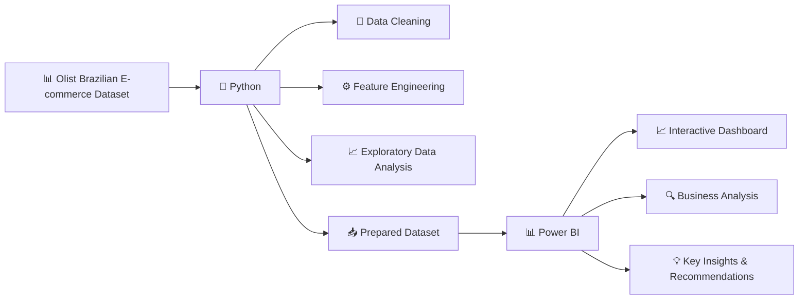

# 🛒 Olist E-commerce Data Analysis

# Problem Statement

## Business Background

Olist is a Brazilian e-commerce platform that acts as a marketplace integrator: small and medium merchants across Brazil sign a single contract with Olist to sell through major marketplaces without negotiating each one individually. When a customer buys a product through an Olist-connected store, the responsible seller is notified to fulfill the order and ships it using Olist’s logistics partners. Once the order is delivered, or once the estimated delivery date has passed, the customer receives a satisfaction survey by email where they can leave a 1 to 5 star review and, optionally, written comments.

## The Business Challenge

Olist’s leadership has approximately two years of order history (September 2016 to October 2018) covering orders, items, payments, products, sellers, customers, reviews, and geolocation data. Review scores, delivery timing, seller performance, and payment behavior all vary considerably across this period, across product categories, and across Brazil’s states, but no single, consolidated analysis has connected these dimensions together. Leadership wants to understand what is actually shaping the customer experience on the platform, and where the clearest opportunities are to improve it as Olist continues to scale to more sellers and more regions of Brazil.

## Objective

This project analyzes **Olist Brazilian e-commerce data** to identify patterns in sales, revenue, product categories, customer geography, delivery performance, payment behaviour, customer satisfaction, and repeat purchasing.

This project was completed as part of a **Data Analysis Hackathon by Gradient Learning**, with the objective of transforming raw e-commerce data into meaningful business insights and actionable recommendations.

The analysis focuses on understanding **where the business is growing, where customer experience is facing friction, and which factors can be improved to support long-term growth**.

## Tech Stack

* **Python** – Data cleaning, feature engineering and exploratory data analysis (EDA)
* **Pandas & NumPy** – Data manipulation and feature engineering
* **Matplotlib & Seaborn** – Exploratory data visualisation
* **Power BI** – Interactive dashboard development and business insights

## Links

- **Dataset:** [Olist Brazilian E-commerce Dataset](https://www.kaggle.com/datasets/olistbr/brazilian-ecommerce)
- **Python Notebook:** [Google Colab](https://colab.research.google.com/drive/12erngs2H0GMYLuhQJNGNNLCSVENvMujY#scrollTo=7645573e)
- **Power BI Dashboard:** [View Dashboard](https://app.powerbi.com/groups/me/reports/b133324c-81ea-4ecb-b7fc-4cf7f5723fb4/d9853e7c2c0336f91555?experience=power-bi)

## 🔄 Project Workflow

## Dashboard
### Page 1

### Page 2

### Page 3

## Key Insights

- Olist generated approximately **99K orders** and **R$16M in item revenue**, showing strong marketplace activity during the analysed period.

- **November 2017 recorded the highest order volume**, with around **7,289 orders**, making it the strongest month in the dataset.

- **Late delivery is strongly associated with lower customer satisfaction**. On-time or early orders had an average review score of around **4.29**, compared with around **2.57 for late orders**.

- As delivery delays become more severe, **review scores decline sharply**, highlighting delivery performance as one of the clearest opportunities to improve customer experience.

- **São Paulo contributes the highest order volume**, followed by other major states such as Rio de Janeiro and Minas Gerais, showing that demand is concentrated in major markets.

- **Bed & bath, health & beauty, sports & leisure, and furniture/decor** are among the strongest product categories by order volume.

- **Credit cards are the dominant payment method**, while higher installment counts are generally associated with higher order values.

- **Repeat customers generate higher revenue per customer** than one-time customers, making customer retention an important growth opportunity.

## Key Recommendations

- **Reduce late deliveries**, especially in regions and operational areas where delivery performance is weaker.

- **Monitor delivery delay severity**, as longer delays are associated with substantially lower review scores.

- **Identify and monitor sellers and categories with weaker delivery or review performance** to improve the overall customer experience.

- Continue supporting popular product categories while also evaluating **order value and customer satisfaction**, rather than focusing only on order volume.

- Maintain flexible **payment and installment options** to support higher-value purchases.

- Focus on **retaining repeat customers**, as repeat customers generate higher revenue per customer than one-time customers.

## Hackathon Experience

Participating in the **Gradient Learning Data Analysis Hackathon** was a great learning experience. It gave me the opportunity to work with a real-world e-commerce dataset and apply my skills in **Python, data analysis and Power BI**.

Through this project, I learned how to turn raw data into meaningful business insights, build an interactive dashboard, and communicate findings through clear data storytelling. The hackathon also helped me improve my **problem-solving, analytical thinking, and data visualisation skills**.

Overall, it was a valuable experience that strengthened my confidence in working on **end-to-end data analysis projects**.
